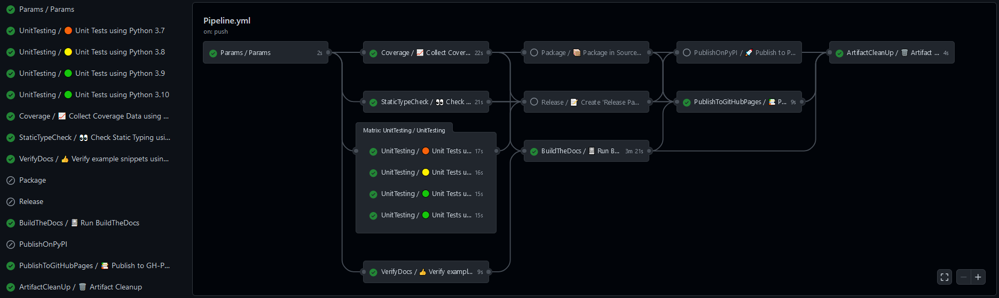

# Actions

Reusable steps and workflows for GitHub Actions, focused on Python packages.

GitHub Actions workflows, actions and documentation are mostly focused on JavaScript/TypeScript as the scripting
language for writing reusable CI code.
However, Python being equally popular and capable, usage of JS/TS might be bypassed, with some caveats.
This repository gathers reusable CI tooling for testing, packaging and distributing Python projects and documentation.

## Context

GitHub Actions supports four types of reusable code:

- JavaScript Action.
  - [docs.github.com: actions/creating-actions/creating-a-javascript-action](https://docs.github.com/en/actions/creating-actions/creating-a-javascript-action)
- Container Action.
  - [docs.github.com: actions/creating-actions/creating-a-docker-container-action](https://docs.github.com/en/actions/creating-actions/creating-a-docker-container-action)
- Composite Action.
  - [docs.github.com: actions/creating-actions/creating-a-composite-action](https://docs.github.com/en/actions/creating-actions/creating-a-composite-action)
  - [github.blog/changelog: 2020-08-07-github-actions-composite-run-steps](https://github.blog/changelog/2020-08-07-github-actions-composite-run-steps/)
  - [github.blog/changelog: 2021-08-25-github-actions-reduce-duplication-with-action-compositio](https://github.blog/changelog/2021-08-25-github-actions-reduce-duplication-with-action-composition/)
- Reusable Workflows.
  - [docs.github.com: actions/learn-github-actions/reusing-workflows](https://docs.github.com/en/actions/learn-github-actions/reusing-workflows)
  - [github.blog/changelog: 2021-10-05-github-actions-dry-your-github-actions-configuration-by-reusing-workflows](https://github.blog/changelog/2021-10-05-github-actions-dry-your-github-actions-configuration-by-reusing-workflows/)

Leaving JavaScript and Container Actions aside, the main differences between Composite Actions and Reusable Workflows
are the following:

- Composite Actions can be executed from a remote/external path or from the checked out branch, and from any location.
  However, Reusable Workflows can only be used through a remote/external path (`{owner}/{repo}/{path}/{filename}@{ref}`),
  where `{path}` must be `.github/workflows`, and `@{ref}` is required.
  See [actions/runner#1493](https://github.com/actions/runner/issues/1493).
  As a result:
  - Local Composite Actions cannot be used without a prior repo checkout, but Reusable Workflows can be used without
  checkout.
  - Testing development versions of local Reusable Workflows is cumbersome, because PRs do not pick the modifications by
  default.
- Composite Actions can include multiple steps, but not multiple jobs.
  Conversely, Reusable Workflows can include multiple jobs, and multiple steps in each job.
- Composite Actions can include multiple files, so it's possible to use files from the Action or from the user's repository.
  Conversely, Reusable Workflows are a single YAML file, with no additional files retrieved by default.

### Callable vs dispatchable workflows

Reusable Workflows are defined through the `workflow_call` event kind.
Similarly, any "regular" Workflow can be triggered through a `workflow_dispatch` event.
Both event kinds support `input` options, which are usable within the Workflow.
Therefore, one might intuitively try to write a workflow which is both callable and dispatchable.
In other words, which can be either reused from another workflow, or triggered through the API.
Unfortunately, that is not the case.
Although `input` options can be duplicated for both events, GitHub's backend exposes them through different objects.
In dispatchable Workflows, the object is `${{ github.event.inputs }}`, while callable workflows receive `${{ inputs }}`.

As a result, in order to make a reusable workflow dispatchable, a wrapper workflow is required.
See, for instance, [hdl/containers: .github/workflows/common.yml](https://github.com/hdl/containers/blob/main/.github/workflows/common.yml) and [hdl/containers: .github/workflows/dispatch.yml](https://github.com/hdl/containers/blob/main/.github/workflows/dispatch.yml).
Alternatively, a normalisation job might be used, similar to the `Parameters` in this repo.

### Call hierarchy

Reusable Workflows cannot call other Reusable Workflows, however, they can use Composite Actions and Composite Actions
can call other Actions.
Therefore, in some use cases it is sensible to combine one layer of reusable workflows for orchestrating the jobs, along
with multiple layers of composite actions.

### Script with post step

JavaScript Actions support defining `pre`, `pre-if`, `post` and `post-if` steps, which allow executing steps at the
beginning or the end of a job, regardless of intermediate steps failing.
Unfortunately, those are not available for any other Action type.

Action [with-post-step](with-post-step) is a generic JS Action to execute a main command and to set a command as a post
step.
It allows using the `post` feature with scripts written in bash, python or any other interpreted language available on
the environment.
See: [actions/runner#1478](https://github.com/actions/runner/issues/1478).

## Reusable workflows

This repository provides 10+ Reusable Workflows based on the CI pipelines of the repos in this organisation,
[EDA²](https://github.com/edaa-org), [VHDL](https://github.com/vhdl), and others.
By combining them, Python packages can be continuously tested and released along with Sphinx documentation sites, to GitHub Releases, GitHub Pages and PyPI.
Optionally, coverage and static type check reports can be gathered.

[](ExamplePipeline.png)

As shown in the screenshot above, the expected order is:

- Global:
  - [Parameters](.github/workflows/Parameters.yml): a workaround for the limitations to handle global variables in
    GitHub Actions workflows (see [actions/runner#480](https://github.com/actions/runner/issues/480)).
    It generates outputs with artifact names and job matrices to be used in other jobs.
- Code testing/analysis:
  - [UnitTesting](.github/workflows/UnitTesting.yml): run unit test with `pytest` using multiple versions of Python, and
    optionally upload results as XML reports.
  - [CoverageCollection](.github/workflows/CoverageCollection.yml): collect coverage data with `pytest` using a single
    version of Python, generate HTML and Cobertura (XML) reports, upload the HTML report as an artifact, and upload the
    results to Codecov and Codacy.
  - [StaticTypeCheck](.github/workflows/StaticTypeCheck.yml): collect static type check result with `mypy`, and
    optionally upload results as an HTML report.
    Example `commands`:

    1. Regular package

      ```yml
      commands: mypy --html-report htmlmypy -p ToolName
      ```

    2. Parent namespace package

      ```yml
      commands: |
        touch Parent/__init__.py
        mypy --html-report htmlmypy -p ToolName
      ```

    3. Child namespace package

      ```yml
      commands: |
        cd Parent
        mypy --html-report ../htmlmypy -p ToolName
      ```

  - [VerifyDocs](.github/workflows/VerifyDocs.yml): extract code examples from the README and test.
- Packaging and releasing:
  - [Release](.github/workflows/Release.yml): publish GitHub Release.
  - [Package](.github/workflows/Package.yml): generate source and wheel packages, and upload them as an artifact.
  - [PublishOnPyPI](.github/workflows/PublishOnPyPI.yml): publish source and wheel packages to PyPI.
- Documentation:
  - [BuildTheDocs](.github/workflows/BuildTheDocs.yml): build Sphinx documentation with BuildTheDocs, and upload HTML as
    an artifact.
  - [PublishToGitHubPages](.github/workflows/PublishToGitHubPages.yml): publish HTML documentation to GitHub Pages.
- Cleanup:
  - [ArtifactCleanUp](.github/workflows/ArtifactCleanUp.yml): delete artifacts.

### Example pipeline

[ExamplePipeline.yml](ExamplePipeline.yml) is an example Workflow which uses all of the Reusable Workflows.
Python package/tool developers can copy it into their repos, in order to use al the reusable workflows straightaway.
Minimal required modifications are the following:

- Set the `name` input of job `Parameters`.
- Specify the `commands` input of job `StaticTypeCheck`.

Find further usage cases in the following list of projects:

- [edaa-org/pyEDAA.ProjectModel](https://github.com/edaa-org/pyEDAA.ProjectModel/tree/main/.github/workflows)
- [edaa-org/pySVModel](https://github.com/edaa-org/pySVModel/tree/main/.github/workflows)
- [VHDL/pyVHDLModel](https://github.com/VHDL/pyVHDLModel/tree/main/.github/workflows)
