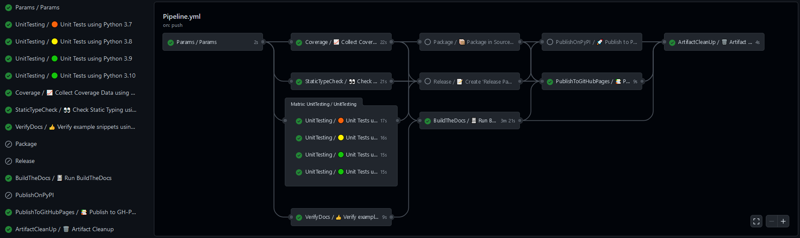
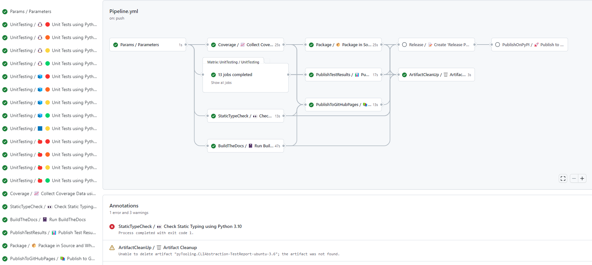

# Actions

Reusable steps and workflows for GitHub Actions, focused on Python packages.

GitHub Actions workflows, actions and documentation are mostly focused on JavaScript/TypeScript as the scripting
language for writing reusable CI code.
However, Python being equally popular and capable, usage of JS/TS might be bypassed, with some caveats.
This repository gathers reusable CI tooling for testing, packaging and distributing Python projects and documentation.

See [GitHub Actions and GitHub Reusable Workflows](https://pytooling.github.io/Actions/Background.html) for more
background information.

## Reusable workflows

This repository provides 10+ *Reusable Workflows* based on the CI pipelines of the repos in this GitHub organisation,
[EDA²](https://github.com/edaa-org), [VHDL](https://github.com/vhdl), and others. By combining them, Python packages can
be continuously tested and released along with Sphinx documentation sites, to GitHub Releases, GitHub Pages and PyPI.
Optionally, coverage and static type check reports can be gathered and integrated into the online documentation.

As shown in the screenshots above, the expected order is:

- Global:
  - [Parameters](.github/workflows/Parameters.yml): a workaround for the limitations to handle global variables in
    GitHub Actions workflows (see [actions/runner#480](https://github.com/actions/runner/issues/480)).
    It generates outputs with artifact names and job matrices to be used in later running jobs.
- Code testing/analysis:
  - [UnitTesting](.github/workflows/UnitTesting.yml): run unit test with `pytest` using multiple versions of Python, and
    optionally upload results as XML reports. Configuration options to `pytest` should be given via section
   `[tool.pytest.ini_options]` in a `pyproject.toml` file.
  - [CoverageCollection](.github/workflows/CoverageCollection.yml): collect code coverage data (incl. branch coverage)
    with `pytest`/`pytest-cov`/`coverage.py` using a single version of Python (latest). It generates HTML and Cobertura
    (XML)reports, upload the HTML report as an artifact, and upload the test results to Codecov and Codacy. Configuration
    options to `pytest` and `coverage.py` should be given via section `[tool.pytest.ini_options]` and `[tool.coverage.*]`
    in a `pyproject.toml` file.
  - [StaticTypeCheck](.github/workflows/StaticTypeCheck.yml): collect static type check result with `mypy`, and
    optionally upload results as an HTML report.
    Example `commands`:

  - [VerifyDocs](.github/workflows/VerifyDocs.yml): extract code examples from the README and test these code snippets.
- Packaging and releasing:
  - [Release](.github/workflows/Release.yml): publish GitHub Release.
  - [Package](.github/workflows/Package.yml): generate source and wheel packages, and upload them as an artifact.
  - [PublishOnPyPI](.github/workflows/PublishOnPyPI.yml): publish source and wheel packages to PyPI.
  - [PublishTestResults](.github/workflows/PublishTestResults.yml): publish unit test results through GH action `dorny/test-reporter`.
- Documentation:
  - [BuildTheDocs](.github/workflows/BuildTheDocs.yml): build Sphinx documentation with BuildTheDocs, and upload HTML as
    an artifact.
  - [PublishToGitHubPages](.github/workflows/PublishToGitHubPages.yml): publish HTML documentation to GitHub Pages.
- Cleanup:
  - [ArtifactCleanUp](.github/workflows/ArtifactCleanUp.yml): delete artifacts.

### Example pipeline

[ExamplePipeline.yml](ExamplePipeline.yml) is an example Workflow which uses all of the Reusable Workflows.
Python package/tool developers can copy it into their repos, in order to use al the reusable workflows straightaway.
Minimal required modifications are the following:

- Set the `name` input of job `Parameters`.
- Specify the `commands` input of job `StaticTypeCheck`.

Find further usage cases in the following list of projects:

- [edaa-org/pyEDAA.ProjectModel](https://github.com/edaa-org/pyEDAA.ProjectModel/tree/main/.github/workflows)
- [edaa-org/pySVModel](https://github.com/edaa-org/pySVModel/tree/main/.github/workflows)
- [VHDL/pyVHDLModel](https://github.com/VHDL/pyVHDLModel/tree/main/.github/workflows)

## Contributors

* [Patrick Lehmann](https://GitHub.com/Paebbels)
* [Unai Martinez-Corral](https://GitHub.com/umarcor) (Maintainer)
* [and more...](https://GitHub.com/pyTooling/Actions/graphs/contributors)

## License

This Python package (source code) licensed under [Apache License 2.0](LICENSE.md).
The accompanying documentation is licensed under [Creative Commons - Attribution 4.0 (CC-BY 4.0)](doc/Doc-License.rst).

---

SPDX-License-Identifier: Apache-2.0
