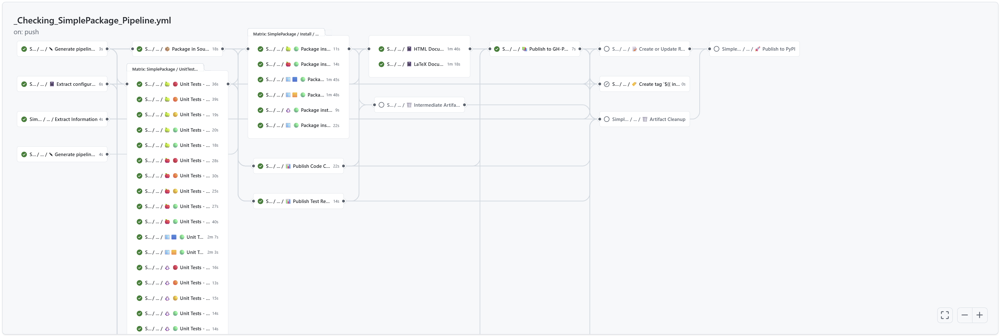

# Actions

Reusable steps and workflows for GitHub Actions, focused on Python packages.

GitHub Actions workflows, actions and documentation are mostly focused on JavaScript/TypeScript as the scripting
language for writing reusable CI code.
However, Python being equally popular and capable, usage of JS/TS might be bypassed, with some caveats.
This repository gathers reusable CI tooling for testing, packaging and distributing Python projects and documentation.

See [GitHub Actions and GitHub Reusable Workflows](https://pytooling.github.io/Actions/Background.html) for more
background information.

## Reusable Actions

- **Artifacts:**  
  [**pyTooling/upload-artifact**](https://github.com/pyTooling/upload-artifact): The upload-artifact action will
  preserve file attributes like permissions.

  [**pyTooling/download-artifact**](https://github.com/pyTooling/download-artifact): The download-artifact action will
  preserve file attributes like permissions.

## Predefined Docker Images

- **Documentation:**  
  [**MikTeX**](https://github.com/pyTooling/MikTeX): A predefined MikTeX image based on Debian Bookworm + Python 3.13
  with specific tools for documentation generation using e.g. Sphinx and related extensions.

## Reusable Workflows

This repository provides 10+ *Reusable Workflows* based on the CI pipelines of the repos in this GitHub organisation,
[EDA²](https://github.com/edaa-org), [VHDL](https://github.com/vhdl), and others. By combining them, Python packages can
be continuously tested and released along with Sphinx documentation sites, to GitHub Releases, GitHub Pages and PyPI.
Optionally, coverage and static type check reports can be gathered and integrated into the online documentation.

As shown in the screenshots above, the expected order is:

- **Global:**  
  [**Parameters**](.github/workflows/Parameters.yml): It generates output parameters with artifact names and job matrices
  to be used in later running jobs.  
  It's a workaround for the limitations to handle global variables in GitHub Actions workflows (see
  [actions/runner#480](https://github.com/actions/runner/issues/480)).
  
  [**ExtractConfiguration**](.github/workflows/ExtractConfiguration.yml): extracts configuration values from
  `pyproject.toml` and exposes configured paths and filenames as job output parameters.
- **Predefined pipelines:**  
  [**CompletePipeline**](.github/workflows/CompletePipeline.yml): is a predefined pipeline for typical Python projects
  using all predefined job templates of pyTooling at once: (unit testing, code coverage, static typing, documentation
  report generation and publishing, packaging, releasing, ...)
- **Code testing/analysis:**  
  [**ApplicationTesting**](.github/workflows/ApplicationTesting.yml): like UnitTesting, but running tests using an
  installed Python package.
  
  [**UnitTesting**](.github/workflows/UnitTesting.yml): run unit test with `pytest` using multiple versions of Python, and
  optionally upload results as XML reports. Configuration options to `pytest` should be given via section
  `[tool.pytest.ini_options]` in a `pyproject.toml` file.  
  Besides test results, also code coverage data (incl. branch coverage) can be collected using
  `pytest`/`pytest-cov`/`coverage.py`. Configuration options to `coverage.py` should be given via section
  `[tool.coverage.*]` in a `pyproject.toml` file.  
  While multiple report formats can be created in the job, it's recommended to use `PublishTestResults` and/or
  `PublishCoverageResults` to merge results from matrix runs and then generate final reports as XML, JSON or HTML.  
  Finally, reports can be published to GitHub Pages or cloud services like Codecov and Codacy.
  
  [**StaticTypeCheck**](.github/workflows/StaticTypeCheck.yml): collect static type check result with `mypy`, and
  optionally upload results as an HTML report.
  
  [**VerifyDocs**](.github/workflows/VerifyDocs.yml): extract code examples from the README and test these code snippets.
- **Packaging and releasing:**  
  [**Package**](.github/workflows/Package.yml): generate source and wheel packages, and upload them as an artifact.

  [**PublishOnPyPI**](.github/workflows/PublishOnPyPI.yml): publish source and wheel packages to PyPI.

  [**PublishTestResults**](.github/workflows/PublishTestResults.yml): publish unit test results through GH action `dorny/test-reporter`.

  [**PublishCoverageResults**](.github/workflows/PublishCoverageResults.yml): publish ucode coverage results.

  [**NightlyRelease**](.github/workflows/NightlyRelease.yml): publish GitHub Release.

  [**Release**](.github/workflows/Release.yml): publish GitHub Release.
- **Documentation:**  
  [**SphinxDocumentation**](.github/workflows/PublishCoverageResults.yml): create HTML and LaTeX documentation using
  Sphinx.
  
  [**LaTeXDocumentation**](.github/workflows/LaTeXDocumentation.yml): compile LaTeX documentation to a PDF file using
  MikTeX.
  
  [**PublishToGitHubPages**](.github/workflows/PublishToGitHubPages.yml): publish HTML documentation to GitHub Pages.
- **Cleanup:**  
  [**IntermediateCleanUp**](.github/workflows/IntermediateCleanUp.yml): delete intermediate artifacts.
  
  [**ArtifactCleanUp**](.github/workflows/ArtifactCleanUp.yml): delete artifacts.
- **⚠ Deprecated ⚠:**  
  [**CoverageCollection**](.github/workflows/CoverageCollection.yml): Use `UnitTesting`, because is can collect code
  coverage too. This avoids code duplication in job templates.
  
  [**BuildTheDocs**](.github/workflows/BuildTheDocs.yml): Use `SphinxDocumentation`, `LaTeXDocumentation` and
  `PublishToGitHubPages`. BuildTheDocs isn't maintained anymore.

### Example pipeline

[ExamplePipeline.yml](ExamplePipeline.yml) is an example Workflow which uses all of the Reusable Workflows.
Python package/tool developers can copy it into their repos, in order to use al the reusable workflows straightaway.
Minimal required modifications are the following:

- Set the `name` input of job `Parameters`.
- Specify the `commands` input of job `StaticTypeCheck`.

Find further usage cases in the following list of projects:

- [edaa-org/pyEDAA.ProjectModel](https://github.com/edaa-org/pyEDAA.ProjectModel/tree/main/.github/workflows)
- [edaa-org/pySVModel](https://github.com/edaa-org/pySVModel/tree/main/.github/workflows)
- [VHDL/pyVHDLModel](https://github.com/VHDL/pyVHDLModel/tree/main/.github/workflows)

## Contributors

* [Patrick Lehmann](https://GitHub.com/Paebbels)
* [Unai Martinez-Corral](https://GitHub.com/umarcor) (Maintainer)
* [and more...](https://GitHub.com/pyTooling/Actions/graphs/contributors)

## License

This Python package (source code) licensed under [Apache License 2.0](LICENSE.md).
The accompanying documentation is licensed under [Creative Commons - Attribution 4.0 (CC-BY 4.0)](doc/Doc-License.rst).

---

SPDX-License-Identifier: Apache-2.0
