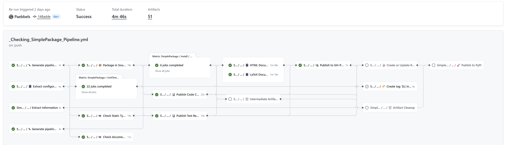

.. include:: shields.inc

.. raw:: latex

   \part{Introduction}

.. only:: html

   |  |SHIELD:svg:pyTooling-github| |SHIELD:svg:pyTooling-src-license| |SHIELD:svg:pyTooling-ghp-doc| |SHIELD:svg:pyTooling-doc-license|
   |  |SHIELD:svg:pyTooling-tag| |SHIELD:svg:pyTooling-date|

.. Disabled shields: |SHIELD:svg:pyTooling-gitter|

.. only:: latex

   |SHIELD:png:pyTooling-github| |SHIELD:png:pyTooling-src-license| |SHIELD:png:pyTooling-ghp-doc| |SHIELD:png:pyTooling-doc-license|
   |SHIELD:png:pyTooling-tag| |SHIELD:png:pyTooling-date|

.. Disabled shields: |SHIELD:svg:pyTooling-gitter|

--------------------------------------------------------------------------------

pyTooling Actions Documentation
###############################

**pyTooling Actions** are reusable steps and workflows for GitHub Actions easing the creation and maintenance of
workflows for Python projects on GitHub.

Introduction
************

GitHub Actions workflows, actions and documentation are mostly focused on JavaScript/TypeScript as the scripting
language for writing reusable CI code.
However, Python being equally popular and capable, usage of JS/TS might be bypassed, with some caveats.
This repository gathers reusable CI tooling for testing, packaging and distributing Python projects and documentation.

GitHub Actions
**************

.. include:: Action/Actions.rst

GitHub Action Job Templates
***************************

The following list categorizes all pre-defined job templates, which can be instantiated in a pipeline (GitHub Action
Workflow):

.. include:: JobTemplate/Templates.rst

Example Pipelines
=================

.. grid:: 2

   .. grid-item::
      :columns: 6

      ``ExamplePipeline.yml`` is an example Workflow which uses all of the Reusable Workflows.
      Python package/tool developers can copy it into their repos, in order to use al the reusable workflows straightaway.
      Minimal required modifications are the following:

      * Set the ``name`` input of job ``Parameters``.
      * Specify the ``commands`` input of job ``StaticTypeCheck``.

      .. rubric:: Behavior

      .. include:: JobTemplate/AllInOne/_Behavior.rst

   .. grid-item::
      :columns: 6

      .. tab-set::

         .. tab-item:: Directory Structure

            .. code-block::

               <RepositoryRoot>/
                 .github/
                   workflows/
                     Pipeline.yml
                 dist/
                   requirements.txt
                 docs/
                   conf.py
                   index.rst
                   requirements.txt
                 myPackage/
                   ModuleA.py
                   __init__.py
                   py.typed
                 tests/
                   unit/
                     TestA.py
                     requirements.txt
                   requirements.txt
                 .editorconfig
                 .gitignore
                 LICENSE.md
                 pyproject.toml
                 README.md
                 requirements.txt
                 setup.py

         .. tab-item:: Simple Package
            :selected:

            .. code-block:: yaml

               name: Pipeline

               on:
                 push:
                 workflow_dispatch:
                 schedule:
               # Every Friday at 22:00 - rerun pipeline to check for dependency-based issues
                   - cron: '0 22 * * 5'

               jobs:
                 SimplePackage:
                   uses: pyTooling/Actions/.github/workflows/CompletePipeline.yml@r5
                   with:
                     package_name: myPackage
                     codecov:      true
                     codacy:       true
                     dorny:        true
                   secrets:
                     PYPI_TOKEN:    ${{ secrets.PYPI_TOKEN }}
                     CODECOV_TOKEN: ${{ secrets.CODECOV_TOKEN }}
                     CODACY_TOKEN:  ${{ secrets.CODACY_TOKEN }}

         .. tab-item:: Namespace Package

            .. code-block:: yaml

               name: Pipeline

               on:
                 push:
                 workflow_dispatch:
                 schedule:
               # Every Friday at 22:00 - rerun pipeline to check for dependency-based issues
                   - cron: '0 22 * * 5'

               jobs:
                 NamespacePackage:
                   uses: pyTooling/Actions/.github/workflows/CompletePipeline.yml@r5
                   with:
                     package_namespace: myFramework
                     package_name:      Extension
                     codecov:           true
                     codacy:            true
                     dorny:             true
                   secrets:
                     PYPI_TOKEN:    ${{ secrets.PYPI_TOKEN }}
                     CODECOV_TOKEN: ${{ secrets.CODECOV_TOKEN }}
                     CODACY_TOKEN:  ${{ secrets.CODACY_TOKEN }}

         .. tab-item:: :file:`pyproject.toml`

            .. code-block:: toml

               [build-system]
               requires = ["setuptools >= 80.0", "wheel ~= 0.45", "pyTooling ~= 8.5"]
               build-backend = "setuptools.build_meta"

               [tool.mypy]
               packages = ["myPackage"]
               python_version = "3.13"
               strict = true
               pretty = true
               show_error_context = true
               show_error_codes = true
               namespace_packages = true
               html_report = "report/typing"

               [tool.pytest]
               junit_xml = "report/unit/UnittestReportSummary.xml"

               [tool.pyedaa-reports]
               junit_xml = "report/unit/unittest.xml"

               [tool.pytest.ini_options]
               addopts = "--tb=native"
               python_files = "*"
               python_functions = "test_*"
               filterwarnings = ["error::DeprecationWarning", "error::PendingDeprecationWarning"]
               junit_logging = "all"

               [tool.interrogate]
               color = true
               verbose = 1             # possible values: 0 (minimal output), 1 (-v), 2 (-vv)
               fail-under = 59
               ignore-setters = true

               [tool.coverage.run]
               branch = true
               relative_files = true
               omit = ["*site-packages*", "setup.py", "tests/unit/*"]

               [tool.coverage.report]
               skip_covered = false
               skip_empty = true
               exclude_lines = ["pragma: no cover", "raise NotImplementedError"]
               omit = ["tests/*"]

               [tool.coverage.xml]
               output = "report/coverage/coverage.xml"

               [tool.coverage.json]
               output = "report/coverage/coverage.json"

               [tool.coverage.html]
               directory = "report/coverage/html"
               title="Code Coverage of myPackage"

References
**********

- `hdl/containers#48 <https://github.com/hdl/containers/issues/48>`__

.. _CONTRIBUTORS:

Contributors
************

* `Patrick Lehmann <https://GitHub.com/Paebbels>`__
* `Unai Martinez-Corral <https://GitHub.com/umarcor>`__ (Maintainer)
* `and more... <https://GitHub.com/pyTooling/Actions/graphs/contributors>`__

.. _LICENSE:

License
*******

.. only:: html

   This Python package (source code) is licensed under `Apache License 2.0 <Code-License.html>`__. |br|
   The accompanying documentation is licensed under `Creative Commons - Attribution 4.0 (CC-BY 4.0) <Doc-License.html>`__.

.. only:: latex

   This Python package (source code) is licensed under **Apache License 2.0**. |br|
   The accompanying documentation is licensed under **Creative Commons - Attribution 4.0 (CC-BY 4.0)**.

.. toctree::
   :caption: Introduction
   :hidden:

   Background
   RepositoryStructure
   Instantiation
   Deveopment
   Dependency
   Releases

.. raw:: latex

   \part{Main Documentation}

.. toctree::
   :caption: Actions
   :hidden:

   Action/index
   Action/Releaser
   Action/With-post-step

.. toctree::
   :caption: Job Templates
   :hidden:

   JobTemplate/index
   JobTemplate/AllInOne/index
   JobTemplate/Setup/index
   JobTemplate/Testing/index
   JobTemplate/Quality/index
   JobTemplate/Documentation/index
   JobTemplate/Package/index
   JobTemplate/Publish/index
   JobTemplate/Release/index
   JobTemplate/Cleanup/index
   JobTemplate/Deprecated/index

.. raw:: latex

   \part{pyDummy Example}

.. toctree::
   :caption: pyDummy Example
   :hidden:

   myPackage/myPackage
   unittests/index
   coverage/index
   CodeCoverage
   Doc. Coverage Report <DocCoverage>
   Static Type Check Report ➚ <typing/index>

.. raw:: latex

   \part{Appendix}

.. toctree::
   :caption: Appendix
   :hidden:

   License
   Doc-License
   TODO
